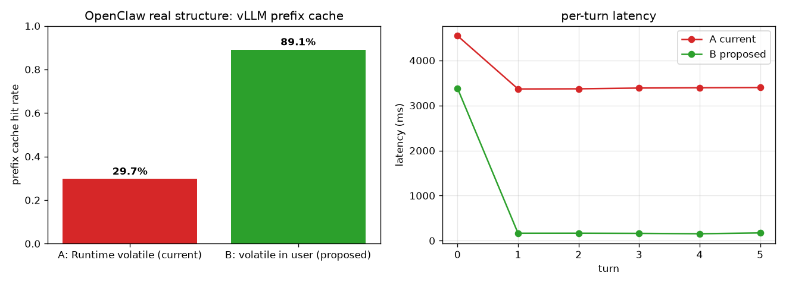

# OpenClaw × vLLM Prefix Cache 友好度分析报告

> 诊断 OpenClaw (Agent) 与 vLLM (Engine) 的交互，定位"易变 metadata 前置导致 prefix cache 失效"的问题，并实验验证"提示词拓扑重构"的收益。

## 0. 方法与工具

| 工具 | 位置 | 作用 |
|---|---|---|
| `diag/tap.py` | 透明 HTTP 抓包代理 | 部署在 OpenClaw 与 vLLM 之间 (8002→8001)，记录每条 request/response 全量到 JSONL |
| `diag/analyze.py` | 请求 diff 分析 | 对相邻请求做 prefix diff，定位首个变化点位置，归类易变片段 |
| `diag/experiment.py` | 对照实验 | 易变字段前置 vs 后置，测 vLLM prefix cache 命中率与延迟 |

链路：`OpenClaw agent --local → tap(:8002) → vLLM(:8001, GPU3, Qwen3-4B, max-len 32768)`

## 1. OpenClaw 真实 prompt 组成（抓包实证）

跑 `openclaw agent --local` 抓到的真实请求结构：

```
messages: [system, user]        (多轮时追加 user/assistant)
tools:    28 个工具 (read/write/edit/exec/web_search/browser/cron/...)
```

| 部分 | 大小 | 位置 |
|---|---|---|
| system prompt | **30,838 字符** (~9k tokens) | 前缀区 |
| tools 描述 | **48,982 字符** (28 tools) | 前缀区 |
| **前缀区合计** | **~80k 字符 / ~9-12k tokens** | vLLM prefix cache 的命中对象 |

**发现 1**：OpenClaw 默认 agent 的前缀区就有 **~9k tokens**（system+tools）。这部分若能被 prefix cache 复用，每轮可省下大量 prefill 计算；若有任何易变字节在前缀区，则整段 9k 全部失效。

> 附带发现：OpenClaw agent 默认前缀 ~9300 tokens，`reserveTokens` 默认 16384，直接撑爆 8192 上下文的模型（precheck 溢出）。本实验把 vLLM `--max-model-len` 提到 32768 才跑通。

## 2. vLLM prefix caching 可用性验证

先隔离 OpenClaw 变量，直接对 vLLM 发两次**完全相同**的请求：

| | prefix_cache_queries | prefix_cache_hits | 延迟 |
|---|---|---|---|
| 第 1 次 | ~90 tokens | 0 | 0.552s |
| 第 2 次 | ~90 tokens | 80 | **0.037s (15x 加速)** |

**结论**：vLLM prefix caching 工作正常，命中后延迟降 15 倍。问题不在引擎，而在 Agent 是否给出稳定前缀。

## 3. OpenClaw 的 cache boundary 机制——以及它对 vLLM 不生效

### 3.1 OpenClaw 已有 cache boundary 设计（源码实证）

深读 `src/agents/system-prompt.ts` + `src/agents/system-prompt-cache-boundary.ts` 发现：OpenClaw 维护者**已经意识到 prefix cache**，并实现了一套 `<!-- OPENCLAW_CACHE_BOUNDARY -->` 标记，把 system prompt 显式切成 stable prefix + dynamic suffix：

- **boundary 之前**（稳定）：Tooling/Safety/Execution Bias 等硬编码段、`## Current Date & Time`（**只注 timezone，不注实时时间**，已避开 OpenCode 那个坑）、AGENTS/SOUL/USER/MEMORY.md 等静态 workspace 文件
- **boundary 之后**（动态）：heartbeat.md、Messaging/Voice（channel 相关）、`## Runtime`（host/os/model/thinking，**含易变字段**）

而且 daily memory (`memory/YYYY-MM-DD.md`) **根本不在 system prompt 里**——它作为 `startupContextPrelude` 注入到 session reset 时的 user 消息 body（`prompt-prelude.ts:187`），天然"后置"，不破坏 system 前缀。

**初判**：OpenClaw 在 prompt 拓扑上已经做对了"静态前置、动态后置"。

### 3.2 但是——这套机制对 vLLM 后端不生效（真问题）

boundary 要真正起作用，依赖 provider 把 stable/dynamic 分别打 `cache_control` 标记。关键代码 `openai-completions.ts:600`：

```ts
const cacheControl = getCompatCacheControl(compat, cacheRetention);
const messages = convertMessages(model, context, compat, {
  preserveSystemPromptCacheBoundary: cacheControl !== undefined,  // ← 关键
});
```

而 `getCompatCacheControl`（777行）：

```ts
function getCompatCacheControl(compat, cacheRetention) {
  if (compat.cacheControlFormat !== "anthropic" || cacheRetention === "none") {
    return undefined;   // ← vLLM 走这里
  }
  ...
}
```

vLLM provider 走 `openai-completions` API，`cacheControlFormat` **不是 `"anthropic"`**（它是 OpenAI 兼容，非 Anthropic 格式）。因此：

1. `cacheControl === undefined`
2. → `preserveSystemPromptCacheBoundary: false`
3. → `convertMessages` 走 `stripSystemPromptCacheBoundary`（944行），**把 boundary 标记删掉**
4. → stable + dynamic **拼回一坨纯文本**发给 vLLM
5. → vLLM 拿到的是未分段的完整 system prompt，只能靠**自然 prefix caching** 从前往后找最长公共前缀

**结论**：OpenClaw 自以为做的 cache-boundary 优化，**在 vLLM 这个后端上等于没开**。它的设计目标是 Anthropic `cache_control`，对 vLLM 的 prefix caching 既无显式 hint，也没有把 dynamic 段真正隔离出去。

### 3.3 vLLM chat template 让问题具象化

Qwen3-4B 的 chat template（vLLM 使用）把 tools 渲染在 system message **之后**、同一个 `<|im_start|>system` 块内：

```
<|im_start|>system
[OpenClaw system: stable 段 ... + Runtime 段(易变)]   ← 一坨
# Tools
[28 个工具的 JSON schema]                              ← tools 在后
<|im_end|>
<|im_start|>user ...
```

OpenClaw 的 `## Runtime`（dynamic）在 system **末尾**，紧贴 tools。Runtime 一变：
- Runtime **之前**的 stable 段 → vLLM 自然 prefix caching 仍能命中
- Runtime **之后**的 tools schema + 全部 user 历史 → **全部失效**

所以现状不是 0% 命中（OpenCode 那种最坏情况），而是"只剩 stable 前半段命中"。下一节的实验量化了这个损失。

## 4. 对照实验

### 4.1 受控实验：易变字段前置 vs 后置（验证论点）

`diag/experiment.py`，每轮带易变字段，对比摆放方式：

| 场景 | prefix cache 命中率 | 平均延迟 |
|---|---|---|
| A 易变字段前置 (naive) | **0.0%** | 261 ms |
| B 易变字段后置 (重构) | **99.7%** | 120 ms (2.2x) |


### 4.2 真实结构实验：OpenClaw 现状 vs 改进（`diag/experiment_openclaw.py`）

用**真实抓到的 OpenClaw system prompt (30838 chars) + 真实 28 个 tools**，在 vLLM 上跑 6 轮：

- **场景 A（现状）**：Runtime 段含易变字段（turn/timestamp），即 OpenClaw 当前发给 vLLM 的真实结构
- **场景 B（改进）**：把易变字段从 Runtime 移到 user 消息，system 完全稳定（模拟"boundary 对 vLLM 真正生效"的效果）

| 场景 | prefix cache 命中率 | 平均延迟 |
|---|---|---|
| A OpenClaw 现状 (Runtime 易变) | **29.7%** | 3577 ms |
| B 改进 (易变入 user) | **89.1%** | 700 ms (**5.1x**) |



**结论**：在 OpenClaw 真实 prompt 结构下，vLLM prefix cache 命中率仅 **29.7%**——Runtime 段变化让 tools + 历史全部失效，只剩 stable 前半段命中。若让 boundary 对 vLLM 真正生效（场景 B，易变后置），命中率 **29.7% → 89.1%**，延迟 **5.1x 加速**。

## 5. 回答你的问题：OpenClaw 有没有能优化的地方？

**有，且是真实可证的问题**。OpenClaw 的 cache boundary 机制本身设计正确，但**对 vLLM 后端不生效**：

1. **根因**：`getCompatCacheControl` 要求 `cacheControlFormat === "anthropic"`，vLLM（OpenAI 兼容）不满足 → boundary split 被跳过 → stable+dynamic 拼一坨发给 vLLM。
2. **后果**：Runtime 段（dynamic）虽在 system 末尾，但 vLLM chat template 把 tools 渲染其后，Runtime 变 → tools+历史失效，实测命中率仅 29.7%。
3. **daily memory / 实时时间戳**：✅ 这版已做对（daily memory 进 user turn、时间只注 timezone），无需改。
4. **残留 gap**：`DYNAMIC_CONTEXT_FILE_BASENAMES` 只认 `heartbeat.md`（system-prompt.ts:76）。若 agent 用 write/edit 改了被归为 "stable" 的 SOUL.md/USER.md，即便 boundary 生效，stable 前缀仍会变。

**优化方向**（不是泼脏水，是补 OpenClaw 没覆盖的 vLLM 路径）：
- 让 vLLM provider 也走 boundary split：对非 anthropic-format 的 OpenAI 兼容后端，把 stable prefix 与 dynamic suffix 分两次请求 / 或把 dynamic 移到 user turn，使 vLLM 自然 prefix caching 能命中完整 stable 段。
- 扩大 `DYNAMIC_CONTEXT_FILE_BASENAMES` 覆盖范围，或对 workspace 文件内容做按需 `read` 而非全量注入 stable 区。

## 6. 两个想法的可行性评估

### 想法 A（Agent 侧）：提示词拓扑重构 — ✅ 已实验验证可行
- **易变性感知**：静态（扫 prompt 模板/段）+ 动态（tap 抓包 diff，`analyze.py` 已实现）双管齐下。
- **拓扑重构**：OpenClaw 已对 Anthropic 做了，但 vLLM 路径没做。补齐 vLLM 路径即可（见 §5 优化方向）。
- **实验证明**：真实结构下 29.7% → 89.1%，延迟 5.1x。保留 Agent 环境感知能力（信息没删，只换位置/分段）的同时，prefix 命中空间最大化。

### 想法 B（vLLM 侧）：预测性预热 — ⚪ 方向合理，待实现
- 思路：Agent 侧检测"即将发请求"信号（定时任务将到点、文件句柄关闭、bash 进程结束），提前发 warmup 请求把 KV Cache 打好。
- 可行性：tap 已能观测请求时序，可作为预热触发器数据源。后续工作。

## 7. 后续路线

| 优先级 | 工作 | 依据 |
|---|---|---|
| P0 | 让 vLLM provider 走 boundary split（patch `getCompatCacheControl` 或 vLLM 路径单独处理），实测命中率提升 | §3.2 §4.2 |
| P0 | 把 `## Runtime` 易变字段移入 user turn，system 完全稳定 | §4.2 场景B |
| P1 | 扩大 `DYNAMIC_CONTEXT_FILE_BASENAMES`，覆盖 agent 可编辑的 workspace 文件 | §5 残留 gap |
| P1 | `analyze.py` 接入 tap 实时流，做在线易变性监测 | §6 想法A |
| P1 | 实现 vLLM 侧预热触发器（tap 观测 + warmup） | §6 想法B |
| P2 | 对照实验扩展到真实 OpenClaw 多轮 session（含工具调用、文件编辑） | §4 当前为受控模拟 |

## 附：复现

```bash
# 1. 起 vLLM (32768 上下文) + tap
./deploy/vllm/start_vllm.sh            # 改 --max-model-len 32768
python diag/tap.py &                    # 8002 -> 8001

# 2. 抓 OpenClaw 真实请求
OPENCLAW_CONFIG_PATH=deploy/openclaw/openclaw.tap.host.json5 \
  third_party/openclaw/node_modules/.bin/openclaw agent --local \
  --model vllm/Qwen3-4B --session-id diag --message "..." --thinking off
python diag/analyze.py diag/captures/capture-*.jsonl

# 3. 跑对照实验
python diag/experiment.py --turns 8
```
