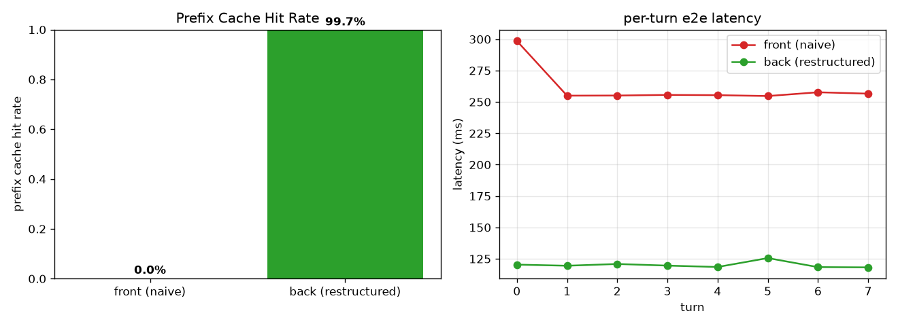

# OpenClaw × vLLM Prefix Cache 友好度分析报告

> 诊断 OpenClaw (Agent) 与 vLLM (Engine) 的交互，定位"易变 metadata 前置导致 prefix cache 失效"的问题，并实验验证"提示词拓扑重构"的收益。

## 0. 方法与工具

| 工具 | 位置 | 作用 |
|---|---|---|
| `diag/tap.py` | 透明 HTTP 抓包代理 | 部署在 OpenClaw 与 vLLM 之间 (8002→8001)，记录每条 request/response 全量到 JSONL |
| `diag/analyze.py` | 请求 diff 分析 | 对相邻请求做 prefix diff，定位首个变化点位置，归类易变片段 |
| `diag/experiment.py` | 对照实验 | 易变字段前置 vs 后置，测 vLLM prefix cache 命中率与延迟 |

链路：`OpenClaw agent --local → tap(:8002) → vLLM(:8001, GPU3, Qwen3-4B, max-len 32768)`

## 1. OpenClaw 真实 prompt 组成（抓包实证）

跑 `openclaw agent --local` 抓到的真实请求结构：

```
messages: [system, user]        (多轮时追加 user/assistant)
tools:    28 个工具 (read/write/edit/exec/web_search/browser/cron/...)
```

| 部分 | 大小 | 位置 |
|---|---|---|
| system prompt | **30,838 字符** (~9k tokens) | 前缀区 |
| tools 描述 | **48,982 字符** (28 tools) | 前缀区 |
| **前缀区合计** | **~80k 字符 / ~9-12k tokens** | vLLM prefix cache 的命中对象 |

**发现 1**：OpenClaw 默认 agent 的前缀区就有 **~9k tokens**（system+tools）。这部分若能被 prefix cache 复用，每轮可省下大量 prefill 计算；若有任何易变字节在前缀区，则整段 9k 全部失效。

> 附带发现：OpenClaw agent 默认前缀 ~9300 tokens，`reserveTokens` 默认 16384，直接撑爆 8192 上下文的模型（precheck 溢出）。本实验把 vLLM `--max-model-len` 提到 32768 才跑通。

## 2. vLLM prefix caching 可用性验证

先隔离 OpenClaw 变量，直接对 vLLM 发两次**完全相同**的请求：

| | prefix_cache_queries | prefix_cache_hits | 延迟 |
|---|---|---|---|
| 第 1 次 | ~90 tokens | 0 | 0.552s |
| 第 2 次 | ~90 tokens | 80 | **0.037s (15x 加速)** |

**结论**：vLLM prefix caching 工作正常，命中后延迟降 15 倍。问题不在引擎，而在 Agent 是否给出稳定前缀。

## 3. OpenClaw 中的易变 metadata 定位

静态+动态分析 system prompt 全文（30k 字符，40+ 个 `##` 段）：

### ✅ 相对干净的部分
- `## Current Date & Time` 段**只含 `Time zone: Asia/Shanghai`**（静态），**没有注入实时时间戳**。
  → 这版 OpenClaw (v2026.6.10) 已经避开了 Kimi 研究员分享的"OpenCode 把系统时间放进 tools 描述"那个坑。

### ⚠️ 仍存在的易变前缀源（按危害排序）

| 易变源 | 位置 | 易变频率 | 危害 |
|---|---|---|---|
| **daily memory 文件** `memory/YYYY-MM-DD.md` | `## Session Startup` 注入到前缀 | **每天** | 跨天前缀全失效（Kimi 8am 现象的同类） |
| **workspace 文件注入** (AGENTS/SOUL/USER/TOOLS/BOOTSTRAP/HEARTBEAT.md) | `## Workspace Files (injected)` 在前缀 | agent 编辑文件即变 | **同 session 内**前缀失效 |
| `## Runtime` 段 (host/os/model/thinking 状态) | system 前部 | 切模型/切 thinking 即变 | 中等 |
| `available_skills` 路径嵌入 CWD | `## Skills` 段 | 换工作目录即变 | 每项目级 |

**最关键的两类**：
1. **daily memory**：`## Session Startup` 明确写了"recent daily memory such as `memory/YYYY-MM-DD.md`"被注入启动上下文。每天日期一变，注入的 memory 文件名/内容变 → 9k 前缀从开头失效。这正是"每天早上 8 点 KV Cache 激增"的机制同类。
2. **workspace 文件注入**：agent 用 `write`/`edit` 工具改了工作区文件，下一轮注入的文件内容就变 → 同一 session 内前缀也失效。这是**逐轮**级别的失效，比跨天更频繁。

## 4. 对照实验：易变字段前置 vs 后置

`diag/experiment.py` 模拟 agent 多轮请求，每轮带一个易变字段（turn 计数器 + 时间戳 + request_id），对比两种摆放方式：

- **场景 A (前置, naive)**：易变字段放 system 最前面（模拟 OpenCode 把时间放 tools 描述、tools 渲染在最前的真实最坏情况）
- **场景 B (后置, 重构)**：易变字段放最后一条 user 消息，system 前缀完全稳定

8 轮请求实测（vLLM prefix_cache_hits/queries 做差）：

| 场景 | prefix cache 命中率 | 平均延迟 |
|---|---|---|
| A 前置 (naive) | **0.0%** | 261 ms |
| B 后置 (重构) | **99.7%** | 120 ms |



**结论**：把易变 metadata 从前缀区移到尾部，prefix cache 命中率从 **0% → 99.7%**，端到端延迟 **2.2x 加速**。论点成立。

> 注：场景 A 命中率为 0 是因为易变字段在最前，vLLM 从第 0 个 token 就分叉，9k 稳定前缀完全无法复用。这正是 OpenCode/Kimi 那类问题的本质。

## 5. 回答你的问题：OpenClaw 有没有能优化的地方？

**有，但比 OpenCode 轻**。具体：

1. **实时时间戳**：✅ 这版已不注入（只注 timezone）。无需改。
2. **daily memory 注入前缀**：⚠️ 是当前最大的跨天失效源。优化方向：memory 文件内容**后置**到 user 消息或单独 system 尾部，前缀只留静态指引。
3. **workspace 文件注入前缀**：⚠️ 逐轮失效源。优化方向：文件内容按需 `read` 而非全量注入前缀；或注入到尾部。
4. **Runtime 段**：低危，但 `thinking=off/on` 切换会变。可后置。
5. **skills 路径嵌入 CWD**：每项目级，低频，可接受。

## 6. 两个想法的可行性评估

### 想法 A（Agent 侧）：提示词拓扑重构 — ✅ 已实验验证可行
- **易变性感知**：静态（扫 prompt 模板/段）+ 动态（tap 抓包 diff，本报告 `analyze.py` 已实现）双管齐下，能自动识别 daily memory / workspace 文件 / Runtime 段为易变源。
- **拓扑重构**：静态段（工具说明、安全规则、角色定义）提至最前；动态段（memory、workspace 文件、Runtime、时间）后置或删除。
- **实验证明**：前缀稳定后命中率 0%→99.7%，延迟 2.2x。保留 Agent 环境感知能力（信息没删，只换位置）的同时，prefix 命中空间最大化。

### 想法 B（vLLM 侧）：预测性预热 — ⚪ 方向合理，待实现
- 思路：Agent 侧检测"即将发请求"的信号（定时任务将到点、文件句柄关闭、bash 进程结束），提前发一个 warmup 请求把 KV Cache 打好。
- 可行性：tap 已能观测请求时序，可作为预热触发器的数据源。实现需 Agent 侧埋点 + warmup 请求构造。属于后续工作。

## 7. 后续路线

| 优先级 | 工作 | 依据 |
|---|---|---|
| P0 | 在 OpenClaw 源码中定位 daily memory / workspace 文件注入点，改为后置 | §3 最大失效源 |
| P0 | 把 `## Runtime` 段后置 | §3 |
| P1 | `analyze.py` 接入 tap 实时流，做在线易变性监测 | §6 想法A |
| P1 | 实现 vLLM 侧预热触发器（tap 观测 + warmup） | §6 想法B |
| P2 | 对照实验扩展到真实 OpenClaw 多轮 session（含工具调用、文件编辑） | §4 当前为受控模拟 |

## 附：复现

```bash
# 1. 起 vLLM (32768 上下文) + tap
./deploy/vllm/start_vllm.sh            # 改 --max-model-len 32768
python diag/tap.py &                    # 8002 -> 8001

# 2. 抓 OpenClaw 真实请求
OPENCLAW_CONFIG_PATH=deploy/openclaw/openclaw.tap.host.json5 \
  third_party/openclaw/node_modules/.bin/openclaw agent --local \
  --model vllm/Qwen3-4B --session-id diag --message "..." --thinking off
python diag/analyze.py diag/captures/capture-*.jsonl

# 3. 跑对照实验
python diag/experiment.py --turns 8
```
